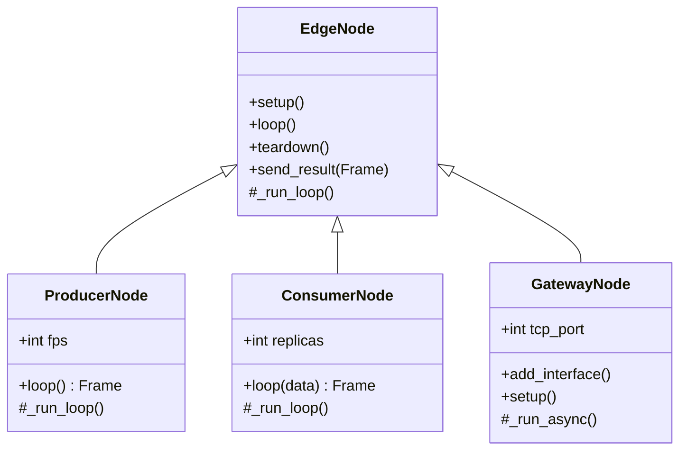
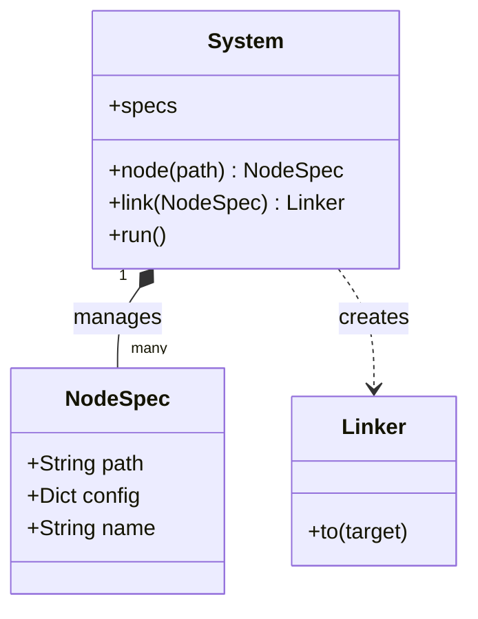
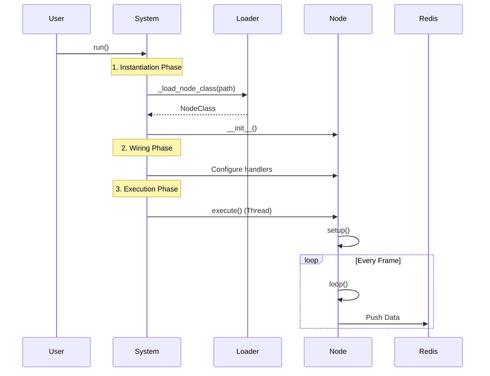
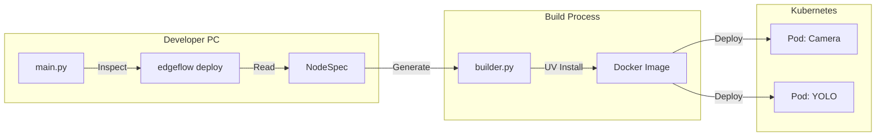

# Edgeflow v0.2.0 Architecture

GitHub 및 Mermaid를 지원하는 마크다운 뷰어에서 렌더링됩니다.

---

## 1. Class Hierarchy (Arduino Pattern)

Edgeflow v0.2.0 uses an inheritance-based structure.

---

## 2. System Blueprint & Lazy Loading

The `System` class uses the Blueprint pattern to manage `NodeSpec`s.

---

## 3. Execution Flow (Local Simulation)

Sequence of loading and executing nodes locally.

---

## 4. Deployment Flow (CLI)

How `edgeflow deploy` works.

