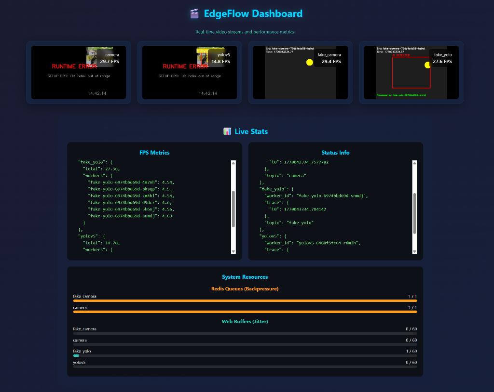

# EdgeFlow

**엣지 AI 파이프라인을 위한 경량 분산 프레임워크**

EdgeFlow는 실시간 영상 분산 처리 파이프라인을 간편하게 구축할 수 있는 프레임워크입니다.
Kubernetes 기반의 자동화된 배포를 지원하며, 노드 추가를 통해 저성능 기기의 한계를 극복하고 처리량(FPS)을 선형적으로 증가시킬 수 있습니다. 

[](../pyproject.toml)
[](https://www.python.org/downloads/)
[](../LICENSE)

[🇺🇸 English](../README.md) | [🇰🇷 한국어](README_kr.md) | [📖 기술 상세 문서](TECHNICAL_DEEP_DIVE.md)



---

## ✨ 주요 기능

| 기능 | 설명 |
|------|------|
| **Arduino 스타일 API** | `setup()` / `loop()` 패턴으로 직관적인 노드 개발 |
| **Fluent Wiring DSL** | `app.link(cam).to(gpu).to(gw)` 체이닝으로 파이프라인 정의 |
| **QoS 기반 스트리밍** | REALTIME (최신만) / DURABLE 소비 모드 |
| **프로토콜 추상화** | Redis / TCP 자동 선택, 사용자 코드는 통신 무관 |
| **Kubernetes 지원** | `edgeflow up`으로 빌드/푸시/배포 원스텝 |
| **Hot Reload (sync)** | 리빌드 없이 실행 중인 파드에 코드 반영 |
| **웹 대시보드** | Gateway가 수신하는 비디오 및 각종 지표 조회 |

---

## 🛠 설치

```bash
# 1. uv 설치
pip install uv

# 2. edgeflow CLI 전역 설치
uv tool install git+https://github.com/seolgugu/edgeflow.git

# 3. 설치 확인
edgeflow --help
```

---

## 🚀 빠른 시작 (로컬 실행)

### 1. 저장소 클론

```bash
git clone https://github.com/seolgugu/edgeflow.git
cd edgeflow
```

### 2. Redis 시작

```bash
docker run -d -p 6379:6379 redis:7-alpine
```

### 3. 예제 실행

```bash
edgeflow local examples/tutorial/main.py
```

### 4. 대시보드 접속

브라우저에서 `http://localhost:8000/dashboard` 접속

---

## 📝 예제 코드 (`main.py`)

```python
from edgeflow import System, QoS
from edgeflow.comms import RedisListBroker

# System 정의
app = System("tutorial", broker=RedisListBroker())

# 노드 등록
cam = app.node("nodes/camera", fps=30)
yolo = app.node("nodes/yolo", replicas=2)
gw = app.node("nodes/gateway", node_port=30080)

# 파이프라인 연결
app.link(cam).to(yolo, qos=QoS.REALTIME).to(gw)  # AI 스트림
app.link(cam).to(gw)                              # 원본 스트림

# 실행
if __name__ == "__main__":
    app.run()
```

---

## 📦 의존성 관리

노드의 의존성(Python 패키지, 시스템 라이브러리)은 `node.toml` 파일에 정의됩니다.
`requirements.txt` 대신 `edgeflow add` 명령어를 사용하여 의존성을 설치하는 것을 권장합니다.

```bash
# 1. Python 패키지 추가 (예: numpy)
edgeflow add numpy --node nodes/my-node

# 2. 시스템 패키지 추가 (예: libgl1) - apt install
edgeflow add libgl1 --node nodes/my-node --apt
```

> **Note:** 의존성이 변경되면 `edgeflow up` 또는 `edgeflow build`를 통해 이미지를 재빌드해야 합니다.

---

## ☸️ Kubernetes 배포

Kubernetes 클러스터에 배포하려면: **[K8s 배포 가이드](getting_started_k8s_kr.md)**

```bash
edgeflow up main.py --registry docker.io/yourusername --arch linux/arm64
```

---

## 🖥 CLI 명령어

| 명령어 | 설명 |
|--------|------|
| `local` | uv로 로컬 실행 |
| `add` | 의존성 추가 |
| `up` | 빌드, 푸시, 배포 (All-in-one) |
| `sync` | 코드를 파드에 즉시 반영 |
| `logs` | 노드 로그 보기 |
| `clean` | 네임스페이스 리소스 정리 |
| `doctor` | 환경 상태 점검 |

---

## 💡 설계 하이라이트

### `link.to()` 체이닝

```python
app.link(cam).to(yolo).to(gw)  # Camera → YOLO → Gateway
```

### QoS 기반 소비

```python
app.link(cam).to(yolo, qos=QoS.REALTIME)   # 최신 프레임만 처리
app.link(cam).to(logger, qos=QoS.DURABLE)  # 모든 프레임 순차 처리
```

---

## 📖 문서

| 문서 | 설명 |
|------|------|
| [**K8s 배포 가이드**](getting_started_k8s_kr.md) | Kubernetes 배포 방법 |
| [**기술 상세 문서**](TECHNICAL_DEEP_DIVE.md) | 핵심 설계 철학 |
| [**English README**](../README.md) | 영문 문서 |

---

## 라이선스

Apache 2.0 License - 자세한 내용은 [LICENSE](../LICENSE) 파일을 참조하세요.
